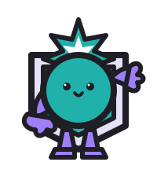

<div align="center">



<br />

<a href="https://github.com/cser-utkarsh-raj"></a>
<a href="https://github.com/cser-utkarsh-raj/GitPix"></a>
<a href="https://github.com/cser-utkarsh-raj/.dot"></a>

</div>

---

## `01` · About

I like taking weird ideas and turning them into working software.

Most of my work lives around **AI tooling, developer products, full-stack applications, and experiments that actually get shipped**. I enjoy moving from rough idea → architecture → implementation → polish.

Currently going deeper into **TypeScript, backend architecture, system design, AI infrastructure, and production engineering**.

> **Do small potato stuff.** But every potato gets turned into a product eventually. 🥔

---

## `02` · Selected Builds

<table>
<tr>
<td width="50%" valign="top">

### [`GitPix`](https://github.com/cser-utkarsh-raj/GitPix)

A template-driven **GitHub profile README designer** for developers who want something more distinctive than a generic stats wall.

`developer tooling` · `visual systems` · `templates`

</td>
<td width="50%" valign="top">

### [`.dot`](https://github.com/cser-utkarsh-raj/.dot)

AI infrastructure for routing requests across model providers through a stable API surface, with provider abstraction and fallback-oriented architecture.

`AI infrastructure` · `APIs` · `Python`

</td>
</tr>
<tr>
<td width="50%" valign="top">

### [`myMentor`](https://github.com/cser-utkarsh-raj/myMentor)

A learning workspace built around roadmaps, daily progress, study tracking, streaks, XP, achievements, and mentorship.

`learning systems` · `product engineering`

</td>
<td width="50%" valign="top">

### [`Shennong`](https://github.com/cser-utkarsh-raj/Shennong)

An agriculture-focused platform exploring intelligent tools, data-driven workflows, and AI/ML-assisted experiences for growers.

`AI/ML` · `agriculture` · `backend`

</td>
</tr>
<tr>
<td width="50%" valign="top">

### [`TerraVault`](https://github.com/cser-utkarsh-raj/TerraVault)

An interactive knowledge platform exploring the wonders, disasters, and enigmas of Earth and beyond.

`knowledge systems` · `web engineering`

</td>
<td width="50%" valign="top">

### [`Sailor`](https://github.com/cser-utkarsh-raj/Sailor)

An anonymous social platform built around spontaneous conversations, communities, discovery, and a nautical identity.

`Next.js` · `PWA` · `product design`

</td>
</tr>
</table>

---

## `03` · Stack

<div align="center">

**Languages**


**Frontend · Backend**


**Infrastructure · Data**


</div>

---

## `04` · GitHub Activity

<div align="center">

<!-- Live image: regenerated by the activity service from GitHub contribution data. -->


<br />


</div>

> **Live data:** the activity graph and statistics are fetched from GitHub-backed services, so new commits are reflected without manually editing this README.

---

## `05` · Currently Exploring

```text
TypeScript        ███████████████░░░  deeper patterns & production usage
System Design     ████████████░░░░░░  architecture & distributed systems
AI Infrastructure ██████████████░░░░  routing, providers & evaluation
Backend           ███████████████░░░  APIs, security & scalability
DevOps            ██████████░░░░░░░░  CI/CD, containers & deployment
```

---

## `06` · Build With Me

Interested in **developer tools, AI products, useful automation, and ambitious side projects**.

<div align="center">

**small idea → prototype → product**

<br />



<br />

<sub>README designed with <a href="https://github.com/cser-utkarsh-raj/GitPix">GitPix</a> · visual system uses the official <a href="https://github.com/cser-utkarsh-raj/.dot">.dot</a> identity</sub>

</div>
