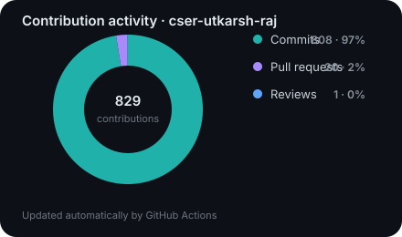
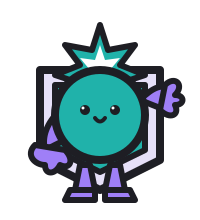

<div align="center">



<br />

<a href="https://github.com/cser-utkarsh-raj"></a>
</div>

---

## `01` · About

I like taking weird ideas and turning them into working software.

Most of my work lives around **AI tooling, developer products, full-stack applications, and experiments that actually get shipped**. I enjoy moving from rough idea → architecture → implementation [...]

Currently going deeper into **TypeScript, backend architecture, system design, AI infrastructure, and production engineering**.

> **Do small potato stuff.** But every potato gets turned into a product eventually. 🥔

---

## `02` · Selected Builds

<table>
<tr>
<td width="50%" valign="top">

### [`TerraVault`](https://github.com/cser-utkarsh-raj/TerraVault)

An interactive knowledge platform exploring the wonders, disasters, and enigmas of Earth and beyond.

`knowledge systems` · `web engineering` · `React` · `TypeScript`

</td>
<td width="50%" valign="top">

### [`StoreBook`](https://github.com/cser-utkarsh-raj/StoreBook)

A comprehensive full-stack e-commerce platform with inventory management, real-time order processing, and seamless user experience.

`full-stack` · `e-commerce` · `React` · `FastAPI` · `PostgreSQL`

</td>
</tr>
<tr>
<td width="50%" valign="top">

### [`The Bloom`](https://github.com/cser-utkarsh-raj/The-Bloom)

A community-driven wellness and mental health platform connecting users with resources, support, and peer experiences.

`wellness` · `community` · `social` · `Next.js` · `Python`

</td>
<td width="50%" valign="top">

### [`goPanda`](https://github.com/cser-utkarsh-raj/goPanda)

A smart logistics and delivery optimization platform using real-time tracking and intelligent routing algorithms.

`logistics` · `optimization` · `real-time` · `Go` · `TypeScript`

</td>
</tr>
<tr>
<td width="50%" valign="top">

### [`ClickHead`](https://github.com/cser-utkarsh-raj/ClickHead)

A precision analytics and click-tracking platform for understanding user behavior and conversion patterns.

`analytics` · `data insights` · `real-time` · `TypeScript` · `PostgreSQL`

</td>
<td width="50%" valign="top">

### [`NailedIt`](https://github.com/cser-utkarsh-raj/NailedIt)

A skill-building and project showcase platform for developers to track progress, build portfolios, and share achievements.

`learning systems` · `product engineering` · `portfolio` · `React` · `Node.js`

</td>
</tr>
</table>

---

## `03` · Stack

<div align="center">

### Languages


### Frontend · Backend


### Infrastructure · Data


</div>

---

## `04` · GitHub Stats

<div align="center">


<br />


</div>

---

## `05` · GitHub Activity

<div align="center">



<br />

<sub>Daily commit activity · automatically refreshed at 01:00 IST by GitHub Actions</sub>

</div>

---

## `06` · Currently Exploring

```text
TypeScript        ███████████████░░░  deeper patterns & production usage
System Design     ████████████░░░░░░  architecture & distributed systems
AI Infrastructure ██████████████░░░░  routing, providers & evaluation
Backend           ███████████████░░░  APIs, security & scalability
DevOps            ██████████░░░░░░░░  CI/CD, containers & deployment
```

---

## `07` · Build With Me

Interested in **developer tools, AI products, useful automation, and ambitious side projects**.

<div align="center">

**small idea → prototype → product**

<br />



<br />

<sub>README designed with <a href="https://github.com/cser-utkarsh-raj/GitPix">GitPix</a> · visual system uses the official <a href="https://github.com/cser-utkarsh-raj/.dot">.dot</a> identity</sub>

</div>